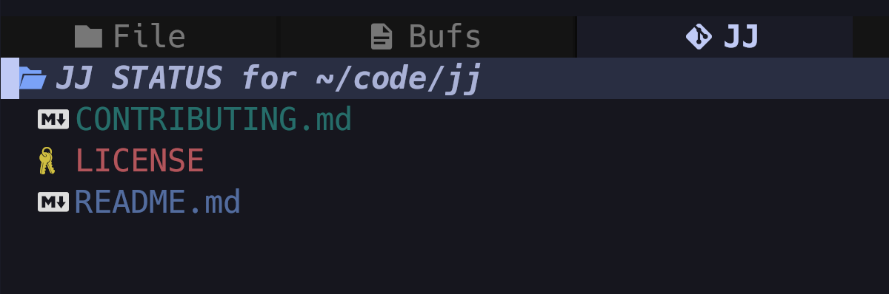

# neo-tree-jj.nvim

A [Neo-tree](https://github.com/nvim-neo-tree/neo-tree.nvim) source for [Jujutsu/jj](https://github.com/martinvonz/jj).

Features:
* Shows changes files like `jj status`
* Shows different status for added/modified/deleted files
* Ability to add/move/delete/rename files/directories and copy/cut/paste



## Quickstart

Lazy.nvim:
```lua
{
  "Cretezy/neo-tree-jj.nvim",
  dependencies = {
    {
      "nvim-neo-tree/neo-tree.nvim",
      opts = function(_, opts)
        -- Register the source
        table.insert(opts.sources, "jj")

        -- Optional: Replace git tab in neo-tree when in jj repo
        if require("neo-tree.sources.jj.utils").get_repository_root() then
          -- Remove git tab
          for i, source in ipairs(opts.source_selector.sources) do
            if source.source == "git_status" then
              table.remove(opts.source_selector.sources, i)
              break
            end
          end

          -- Add jj tab
          table.insert(opts.source_selector.sources, {
            display_name = "󰊢 JJ",
            source = "jj",
          })
        end
      end,
    },
  },
},
```

After installing, open Neo-tree and navigate to the tab, or run `:Neotree jj`

